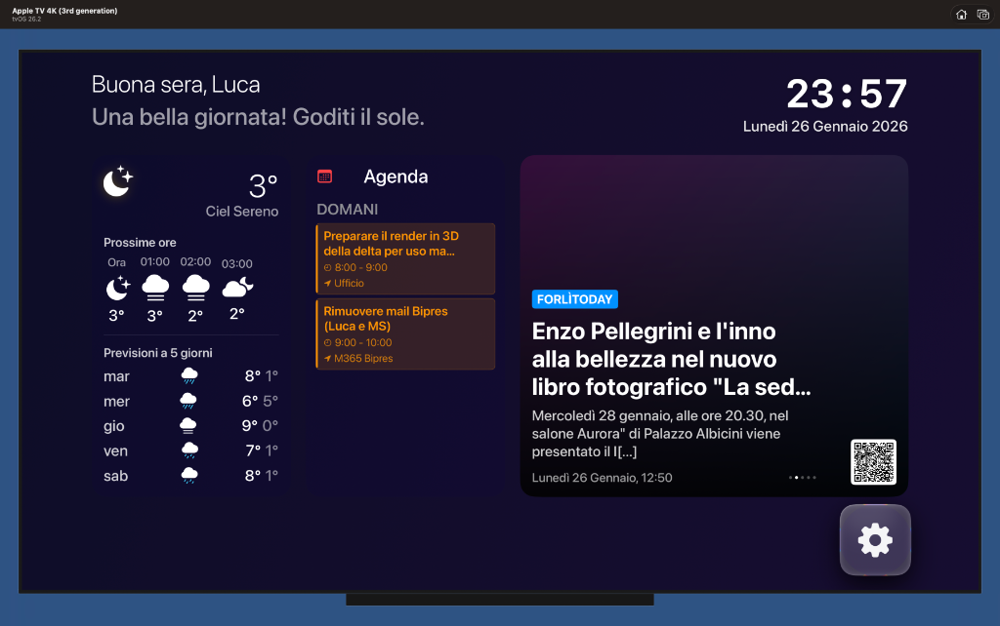

# Apple TV+ Dashboard Clone

This project is a clone of the Apple TV+ dashboard, built with React, Vite, and Tailwind CSS.



## Features

*   **Responsive Design:** The dashboard is fully responsive and looks great on all devices.
*   **Component-Based Architecture:** The UI is built with reusable React components.
*   **Styling with Tailwind CSS:** The project uses Tailwind CSS for a utility-first styling approach.
*   **Fast Development with Vite:** Vite provides a fast and lean development experience for modern web projects.

## Getting Started

### Prerequisites

*   Node.js (v18 or higher)
*   npm or yarn

### Installation

1.  **Clone the repository:**

    ```bash
    git clone https://github.com/your-username/your-repo-name.git
    ```

2.  **Navigate to the project directory:**

    ```bash
    cd your-repo-name
    ```

3.  **Install the dependencies:**

    ```bash
    npm install
    ```

### Running the Development Server

To start the development server, run the following command:

```bash
npm run dev
```

This will start the development server at `http://localhost:3000`.

## Building for Production

To create a production build of the app, run the following command:

```bash
npm run build
```

This will create a `dist` folder with the production-ready files.

## License

This project is licensed under the MIT License. See the [LICENSE](LICENSE) file for details.
